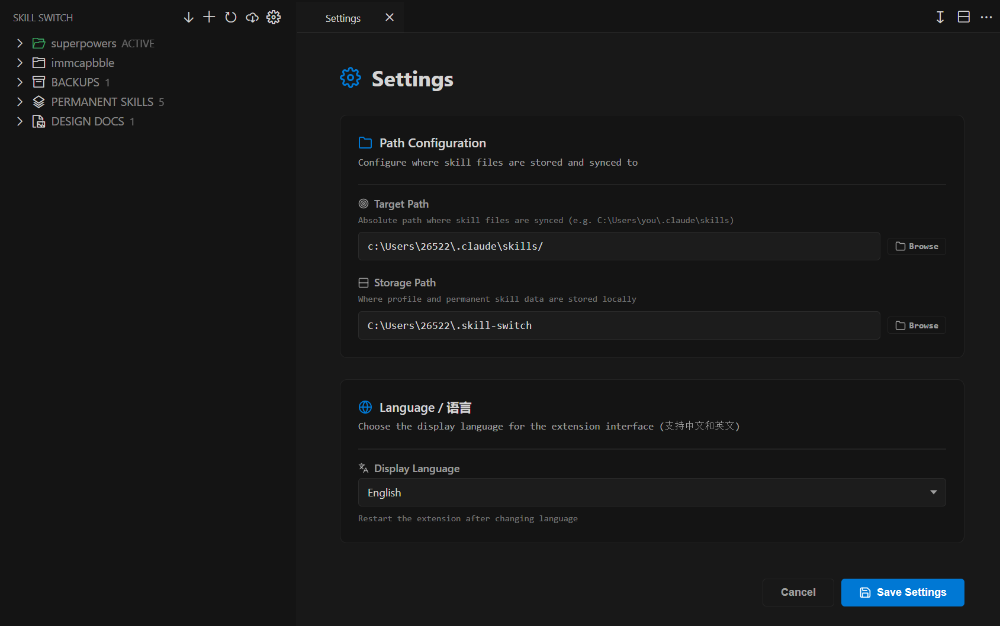

# Skill Switch

[English](#english) | [中文](#中文)

---

## English

**Skill Switch** is a VS Code extension for switching between different skill systems. For example, when using systems like superpowers, immcapbble, etc., which are difficult to merge with each other and would make the skills folder bloated if placed together.

### Features

- **Profile Management**: Create multiple skill profiles (e.g., "Frontend Dev", "Backend API", "DevOps") and switch between them instantly.
- **Checkbox Control**: Enable or disable individual skills within a profile with a single click.
- **Permanent Skills**: Define skills that stay active across all profiles.
- **Design Documents**: Organize and manage design docs, architecture diagrams, and reference materials alongside your skills.
- **Auto Import**: Automatically import existing skill directories on first launch.
- **Backup & Restore**: Create snapshots of your profiles and restore them anytime.
- **Bilingual UI**: Full support for English and Chinese (中文).
- **Real-time Sync**: Changes are synced to your configured target path immediately.

### Screenshot

### Quick Start

1. Open the **Skill Switch** view from the Activity Bar.
2. Click **Settings** to configure your target path (where AI tools read skills from).
3. Create your first profile and add skills.
4. Click **Activate** on a profile to sync it to the target path.

### Configuration

| Setting | Description | Default |
|---------|-------------|---------|
| Target Path | Where skill files are synced to (e.g., `~/.claude/skills`) | `~/.claude/skills` |
| Storage Path | Where profiles and data are stored locally | `~/.skill-switch` |
| Language | Display language (`en` or `zh`) | `en` |

### Requirements

- VS Code 1.87.0 or higher

### License

[MIT](LICENSE)

---

## 中文

**Skill Switch** 是一个 VS Code 扩展，用于在不同体系的SKILL中来回切换。例如superpowers、immcapbble等难以互相融合且同时将其置入skills文件夹内会十分臃肿的情况。

### 功能特性

- **配置管理**：创建多个技能配置（如“前端开发”、“后端 API”、“DevOps”），并即时切换。
- **复选框控制**：单击即可启用或禁用配置中的单个技能。
- **常驻技能**：定义在所有配置中始终保持激活的技能。
- **设计文档**：组织和管理设计文档、架构图及参考资料。
- **自动导入**：首次启动时自动导入现有的技能目录。
- **备份与恢复**：为配置创建快照，随时恢复。
- **双语界面**：完整支持英文和中文。
- **实时同步**：更改会立即同步到已配置的目标路径。

### 界面预览

### 快速开始

1. 从活动栏打开 **Skill Switch** 视图。
2. 点击**设置**，配置目标路径（AI 工具读取技能文件的位置）。
3. 创建第一个配置并添加技能。
4. 点击配置上的**激活**，将其同步到目标路径。

### 配置说明

| 设置项 | 说明 | 默认值 |
|--------|------|--------|
| 目标路径 | 技能文件同步到的位置（如 `~/.claude/skills`） | `~/.claude/skills` |
| 存储路径 | 配置和数据在本地存储的位置 | `~/.skill-switch` |
| 语言 | 显示语言（`en` 或 `zh`） | `en` |

### 环境要求

- VS Code 1.87.0 或更高版本

### 许可证

[MIT](LICENSE)
